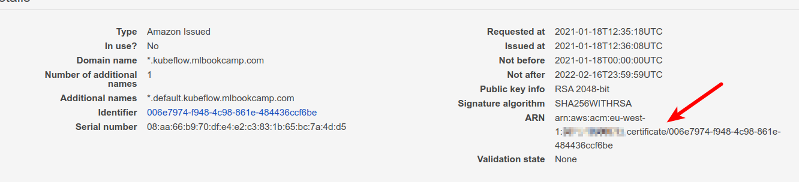

# Serving Deep Learning with KServe (Formerly KFServing) 

We’ll cover:

- Configuring a domain for serving models
- Creating an EKS cluster
- Installing KServe (without the entire Kubeflow)
- Serving the model
- Creating a transformer for pre- and post-processing
- Code: [https://github.com/alexeygrigorev/kubeflow-deep-learning](https://github.com/alexeygrigorev/kubeflow-deep-learning)
- Join DataTalks.Club to talk about this tutorial: [https://datatalks.club/slack.html](https://datatalks.club/slack.html)
- Want to learn more about machine learning and deploying models? Check [Machine Leanring Zoomcamp](https://github.com/alexeygrigorev/mlbookcamp-code/tree/master/course-zoomcamp) - a free course about machine leanring engineering


Prerequisites:

- Your own domain (maybe it’s possible to do it without a custom
  domain, but I don’t know. Let me know if you find a way to do it)
- AWS cli
- Kubectl and eksctl installed (see [this tutorial](https://github.com/alexeygrigorev/kubernetes-deep-learning/blob/main/guide.md) for the instructions)


## Clone this Repo

We’ll need some files from this repo:

```bash
git clone git@github.com:alexeygrigorev/kubeflow-deep-learning.git
```

## Create a EKS cluster

We’ll use eksctl for creating a cluster.
[More info](https://docs.aws.amazon.com/eks/latest/userguide/getting-started-eksctl.html).

Create a config file (`cluster.yaml`):

```yaml
apiVersion: eksctl.io/v1alpha5
kind: ClusterConfig

metadata:
  name: mlzoomcamp-eks
  region: eu-west-1

nodeGroups:
  - name: ng
    desiredCapacity: 2
    instanceType: m5.xlarge
```

Change the region if needed.

Apply it:

```bash
eksctl create cluster -f cluster.yaml
```

It takes a while — up to 20 minutes. In the meantime, you can do the
next steps (configuring a subdomain and certificate manager).

It should create a cluster and put the config to `~/.kube/config`. If
there’s an error and it doesn’t create the config file, create it with
AWS cli:

```bash
aws eks --region eu-west-1 update-kubeconfig --name mlzoomcamp-eks
```

Verify that you can connect to the cluster:

```bash
kubectl get service
```

It should return the list of services currently running on a cluster:

```
NAME         TYPE        CLUSTER-IP   EXTERNAL-IP   PORT(S)   AGE
kubernetes   ClusterIP   10.100.0.1   <none>        443/TCP   6m17s
```


## Configuring a subdomain

Go to "Route 53", create a hosted zone. Put any subdomain there. For
example, "kubeflow.mlbookcamp.com":


When it’s created, note the NS record:


Here they are:

  - `ns-1665.awsdns-16.co.uk.`
  - `ns-1115.awsdns-11.org.`
  - `ns-913.awsdns-50.net.`
  - `ns-192.awsdns-24.com.`

Now configure it in your domain provider. Go to DNS settings of your
domain provider (e.g. GoDaddy). Create a new NS (Namespace) record for
each:


## Configuring Certificate Manager

To access the endpoint with http, you’ll need to create a certificate.

Go to Certificate Manager and select “Provision certificates”. Choose
“Request a public certificate”, click “request a certificate”. Choose
the “DNS validation method”.

Click “request” and then, in the next step, click on the domain name,
and then click “Create record in Route 53”.


Validating the certificate should be fast (1-2 minutes), but may take
more time (up to 30 minutes).

Take a note of the certificate’s ARN. We’ll need it for the next step.




## Install KServe


We’ll use the quick install script. It will install

- Istio
- KNative Serving
- Cert manager
- KServe


Go to the `install` directory. First, rename
`istio-operator-template.yaml` to `istio-operator.yaml`

Find the line with
`"service.beta.kubernetes.io/aws-load-balancer-ssl-cert"` and use your
certificate ARN from the previous step.

Run the installation script:

```bash
./install.sh
```

(Note that the script uses a relatively old istio - I didn't figure out how to make it work
with the newer one. Reach out to me if you know how to do it or create a PR.)

Next, we need it to use our domain. Create a config file for it
(`config-domain.yaml`):

```yaml
apiVersion: v1
kind: ConfigMap
metadata:
  name: config-domain
  namespace: knative-serving
data:
  kubeflow.mlbookcamp.com: ""
```

Replace "kubeflow.mlbookcamp.com" with your domain name.

Apply it:

```bash
kubectl apply -f config-domain.yaml
```

Check that it installed correctly:

```bash
kubectl get pod -n kserve
```

You should see:

```
NAME                             READY   STATUS    RESTARTS   AGE
kfserving-controller-manager-0   2/2     Running   0          107s
```

## Configure Route53

The previous step installed Istio. It created a load balancer. We’ll now
need the domain we created previously to point to that ELB.

Go to EC2, select “Load Balancers'', find the load balancer created by
Istio. If you have multiple load balancers, look for the one with tag
“tag:kubernetes.io/cluster/ml-bookcamp-eks : owned”


Copy its DNS name.

Then go to Route53, select the hosted zone we created previously and
create a new CNAME record:

- Record name: `*` (asterisk)
- Record type: `CNAME`
- Value: the DNS name of the load balancer


Now this domain can be used by KServe.

> Note: it may take some time before the DNS name could be reachable
> from your computer


## Deploying a test model to KServe

This step is optional. Feel free to jump to the next section.

Let’s deploy a simple model. Create a config ("tf-flowers.yaml" - we copied it from [KServe repo](https://github.com/kserve/kserve/blob/master/docs/samples/v1beta1/tensorflow/tensorflow.yaml))
with this content:

```yaml
apiVersion: "serving.kserve.io/v1beta1"
kind: "InferenceService"
metadata:
  name: "flower-sample"
spec:
  predictor:
    tensorflow:
      storageUri: "gs://kfserving-samples/models/tensorflow/flowers"
```

Apply it:

```bash
kubectl apply -f tf-flowers.yaml
```

Check that it works:

```bash
kubectl get inferenceservice
```

The output:

```
NAME             URL                                                                              READY   DEFAULT TRAFFIC   CANARY TRAFFIC   AGE
flowers-sample   http://flowers-sample.default.kubeflow.mlbookcamp.com/v1/models/flowers-sample   True    100                                45m
```

It might take a few minutes before you see that it's ready (`READY` is `True`).


Test it with curl:

```bash
MODEL="flower-sample"
DOMAIN="kubeflow.mlbookcamp.com"

curl -X POST \
    -H 'Content-Type: application/json' \
    -d @flowers-input.json \
    https://${MODEL}.default.${DOMAIN}/v1/models/${MODEL}:predict 
```

The output:

```json
{
    "predictions": [
        {
            "prediction": 0,
            "key": "   1",
            "scores": [0.999114931, 9.20989623e-05, 0.000136786737, 0.000337258854, 0.000300533458, 1.84814289e-05]
        }
    ]
}
```

It works! We can delete this model:

```bash
kubectl delete -f tf-flowers.yaml
```

Let’s now deploy our own model.


## Configure KServe to use S3

We will save our model to S3, so KServe will need to be able to
access it to fetch the model files. We need to do it by providing
credentials.

(Not sure if it can use a role, if it can, please let me
know and I’ll update the tutorial).

The credentials need to be encoded with base64. Let’s do it:

```bash
echo -ne ${AWS_ACCESS_KEY_ID} | base64
echo -ne ${AWS_SECRET_ACCESS_KEY} | base64
```

Now create a config with secrets (`kserve-s3-secret.yaml` - or copy
`install/kserve-s3-secret-template.yaml` and modify it). 
Change the region if you need:

```yaml
apiVersion: v1
kind: Secret
metadata:
  name: mysecret
  annotations:
    serving.kserve.io/s3-endpoint: s3.eu-west-1.amazonaws.com
    serving.kserve.io/s3-usehttps: "1"
    serving.kserve.io/s3-verifyssl: "1"
    serving.kserve.io/s3-region: eu-west-1
    serving.kserve.io/s3-useanoncredential: "false"
type: Opaque
data:
  # echo -ne "AKIAxxx" | base64
  AWS_ACCESS_KEY_ID: INSERT_BAS64_KEY_HERE
  AWS_SECRET_ACCESS_KEY: INSERT_BASE64_SECRET_HERE
---
apiVersion: v1
kind: ServiceAccount
metadata:
  name: sa
secrets:
  - name: mysecret
```

Apply it:


```bash
kubectl apply -f kserve-s3-secret.yaml
```


Now KServe will be able to fetch models from S3

By the way, this is how the config for the test flowers model looks like
when the models are in S3:

```yaml
apiVersion: "serving.kserve.io/v1beta1"
kind: "InferenceService"
metadata:
  name: "flower-sample"
spec:
  predictor:
    serviceAccountName: sa
    tensorflow:
      storageUri: "s3://mlbookcamp-models/flowers"
```

We add `serviceAccountName` and change the `storageUri` to use s3.

## Prepare the model

Now, let’s prepare the clothing model (it was trained [here](https://github.com/alexeygrigorev/mlbookcamp-code/blob/master/chapter-07-neural-nets/07-neural-nets-train.ipynb)).

First, we need to download the model:

```bash
wget http://bit.ly/mlbookcamp-clothing-model -O xception_v4_large_08_0.894.h5
```

Convert it to the "saved_model" format. Put this to `convert.py`:

```python
import tensorflow as tf
from tensorflow import keras

model = keras.models.load_model('xception_v4_large_08_0.894.h5')

tf.saved_model.save(model, 'clothing-model')
```

Run it:

```bash
python convert.py
```

You should have a "clothing-model" folder with the model.

Now create an S3 bucket — we’ll keep the model there.
The region for the bucket should be the same as the region for the EKS cluster.

```bash
aws s3api create-bucket \
    --bucket mlbookcamp-models \
    --region eu-west-1 \
    --create-bucket-configuration LocationConstraint=eu-west-1
```


Upload the model:


```bash
aws s3 cp --recursive clothing-model s3://mlbookcamp-models/clothing-model/0001/
```

Note `0001` at the end — this is important. This is the version of the
model.


## Deploying the clothes model

Let’s deploy the model. Create a config file (`tf-clothing-base.yaml`):

```yaml
apiVersion: "serving.kserve.io/v1beta1"
kind: "InferenceService"
metadata:
  name: "clothing-model"
spec:
  predictor:
    serviceAccountName: sa
    tensorflow:
      storageUri: "s3://mlbookcamp-models/clothing-model"
```

Apply it:

```bash
kubectl apply -f tf-clothing-base.yaml
```

Check it

```bash
kubectl get inferenceservice
```

Results (after 1-2 minutes):

```
NAME             URL                                                                              READY   DEFAULT TRAFFIC   CANARY TRAFFIC   AGE
clothing-model   http://clothing-model.default.kubeflow.mlbookcamp.com/v1/models/clothing-model   True    100                                97s
```


Take a note of the host and the model name:

- The host: "clothing-model.default.kubeflow.mlbookcamp.com"
- The model name: "clothing-model"

Note: It may take some time before the model is reachable from your
laptop — changes in DNS may need some time to propagate.


## Using the model

Let’s test it. Create a script for that (`test.py`):

```python
import requests
from keras_image_helper import create_preprocessor

preprocessor = create_preprocessor('xception', target_size=(299, 299))

url = 'https://clothing-model.default.kubeflow.mlbookcamp.com/v1/models/clothing-model:predict'
image_url = "http://bit.ly/mlbookcamp-pants"
X = preprocessor.from_url(image_url)

data = {
    "instances": X.tolist()
}

resp = requests.post(url, json=data)

results = resp.json()
pred = results['predictions'][0]

labels = [
    'dress',
    'hat',
    'longsleeve',
    'outwear',
    'pants',
    'shirt',
    'shoes',
    'shorts',
    'skirt',
    't-shirt'
]

result = {c: p for c, p in zip(labels, pred)}
print(result)
```

It uses the [keras_image_helper](https://github.com/alexeygrigorev/keras-image-helper) library.
Let’s install it:

```bash
pip install keras_image_helper
```

Run the script:

```bash
python test.py
```

Output:

```python
{'dress': -1.86828923, 'hat': -4.76124525, 'longsleeve': -2.31698346,
'outwear': -1.06257045, 'pants': 9.88715553, 'shirt': -2.81243205,
'shoes': -3.66628242, 'shorts': 3.20036, 'skirt': -2.60233665,
't-shirt': -4.83504581}
```

## KServe Transformers

With the previous setup we have a few problems:

- We need to prepare the data on the client
- We do post-processing on the client as well to find out which
  class it is

Instead, we can do it on the KFSeving side using Transformers.

In this case, the transformer will sit between the client and the model
and do the transformation. The client will only need to supply the URLs
for the images.


In the transformer:

- Pre-processing: convert the URL to a NumPy array and then a list
  of floats
- Post-processing: convert the raw predictions to predictions with
  labels

In KServe, transformers are deployed separately from the model, so
they can scale up independently. It’s good, because they do a different
kind of work — the transformer is doing I/O work (fetching the image),
while the model is doing compute work (the number crunching).


### Creating a transformer

> Note: you can skip this part and use a tranformer that we
> already prepared

To do it, we’ll need to install the kserve package for python:

```bash
pip install kserve
```

To define a transformer, we need to extend the `kserve.Model` class.
Let's create a python file with that ("image_transformer.py"):


```python
import argparse
import kserve

from keras_image_helper import create_preprocessor


class ImageTransformer(kserve.KFModel):
    def __init__(self, name, predictor_host):
        super().__init__(name)
        self.predictor_host = predictor_host
        self.preprocessor = create_preprocessor('xception', target_size=(299, 299))
        self.labels = [
            'dress',
            'hat',
            'longsleeve',
            'outwear',
            'pants',
            'shirt',
            'shoes',
            'shorts',
            'skirt',
            't-shirt'
        ]

    def image_transform(self, instance):
        url = instance['url']
        X = self.preprocessor.from_url(url)
        return X[0].tolist()

    def preprocess(self, inputs):
        instances = [self.image_transform(instance) for instance in inputs['instances']]
        return {'instances': instances}

    def postprocess(self, outputs):
        results = []

        raw = outputs['predictions']

        for row in raw:
            result = {c: p for c, p in zip(self.labels, row)}
            results.append(result)

        return {'predictions': results}


if __name__ == "__main__":
    parser = argparse.ArgumentParser(parents=[kserve.kfserver.parser])
    parser.add_argument('--model_name',
                        help='The name that the model is served under.')
    parser.add_argument('--predictor_host', help='The URL for the model predict function', required=True)

    args, _ = parser.parse_known_args()

    transformer = ImageTransformer(args.model_name, predictor_host=args.predictor_host)
    kserver = kserve.KFServer()
    kserver.start(models=[transformer])
```


Let's test it:

```bash
HOST="clothing-model.default.kubeflow.mlbookcamp.com"

python image_transformer.py \
    --predictor_host="${HOST}" \
    --model_name="clothing-model"
```


It runs a web service locally, and we can use it for testing the
transformer. So let’s create another file for testing it
("test-transformer.py"):

```python
import requests

data = {
    "instances": [
        {"url": "http://bit.ly/mlbookcamp-pants"},
    ]
}

url = 'http://localhost:8080/v1/models/clothing-model:predict'

result = requests.post(url, json=data).json()

print(result)
```

Run it:
```bash
python test-transformer.py
```

The output:

```python
{'predictions': [{'dress': -1.86828923, 'hat': -4.76124525,
'longsleeve': -2.31698346, 'outwear': -1.06257045, 'pants': 9.88715553,
'shirt': -2.81243205, 'shoes': -3.66628242, 'shorts': 3.20036, 'skirt':
-2.60233665, 't-shirt': -4.83504581}]}
```

Now let’s prepare a docker file for the tranformer ("transformer.dockerfile"):


```docker
FROM python:3.8-slim

RUN pip install --upgrade pip

RUN pip install kserve>=0.7.0 \
    argparse>=1.4.0 \
    pillow==7.1.0 \
    keras_image_helper==0.0.1

COPY image_transformer.py image_transformer.py 

ENTRYPOINT ["python", "image_transformer.py"]
```

Build it:

```bash
IMAGE_LOCAL="clothing-model-transformer"
docker build -t ${IMAGE_LOCAL} -f transformer.dockerfile .
```

Authenticate with AWS cli, tag the image and push it to ECR (assuming
you created a registry “model-serving” in eu-west-1 — adjust it to your
case)


```bash
$(aws ecr get-login --no-include-email)

ACCOUNT=XXXXXXXXXXXX
REGISTRY=${ACCOUNT}.dkr.ecr.eu-west-1.amazonaws.com/model-serving
IMAGE_REMOTE=${REGISTRY}:${IMAGE_LOCAL}
docker tag ${IMAGE_LOCAL} ${IMAGE_REMOTE}

docker push ${IMAGE_REMOTE}
```


Before using this new transformer, let’s delete the old inference
service first:

```bash
kubectl delete -f tf-clothing-base.yaml
```

Now let’s adjust the definition (`tf-clothing-transformer.yaml`):

```yaml
apiVersion: "serving.kubeflow.org/v1alpha2"
kind: "InferenceService"
metadata:
  name: "clothing-model"
spec:
  default:
    predictor:
      serviceAccountName: sa
      tensorflow:
        storageUri: "s3://mlbookcamp-models/clothing-model"
    transformer:
      custom:
        container:
          image: XXXXXXXXXXXX.dkr.ecr.eu-west-1.amazonaws.com/model-serving:clothing-model-transformer
          name: user-container
```

Apply it


```bash
kubectl apply -f tf-clothing-transformer.yaml
```

Update the url in the "test-transformer.py" script:

```python
url =
'https://clothing-model.default.kubeflow.mlbookcamp.com/v1/models/clothing-model:predict'
```

Test it:

```bash
python test-transformer.py
```

Response:

```python
{'predictions': [{'dress': -1.86828923, 'hat': -4.76124525,
'longsleeve': -2.31698346, 'outwear': -1.06257045, 'pants': 9.88715553,
'shirt': -2.81243205, 'shoes': -3.66628242, 'shorts': 3.20036, 'skirt':
-2.60233665, 't-shirt': -4.83504581}]}
```

### Using existing transformer

Instead of creating your own tranformer, you can use an existing one:

```yaml
apiVersion: "serving.kubeflow.org/v1alpha2"
kind: "InferenceService"
metadata:
  name: "clothing-model"
spec:
  default:
    predictor:
      serviceAccountName: sa
      tensorflow:
        storageUri: "s3://mlbookcamp-models/clothing-model"
    transformer:
      custom:
        container:
          image: "agrigorev/kfserving-keras-transformer:0.0.1"
          name: user-container
          env:
            - name: MODEL_INPUT_SIZE
              value: "299,299"
            - name: KERAS_MODEL_NAME
              value: "xception"
            - name: MODEL_LABELS
              value: "dress,hat,longsleeve,outwear,pants,shirt,shoes,shorts,skirt,t-shirt"
```

It uses [kfserving-keras-transformer](https://github.com/alexeygrigorev/kfserving-keras-transformer).


## Deleting the cluster

Don’t forget to delete your cluster when you finish your experiments.
Use eksctl for that:

```bash
eksctl delete cluster --name mlzoomcamp-eks
```

If you see that some pods refuse to be deleted, it's probably because of 
istio and knative. We can manually remove the namespaces with these pods:

```bash
kubectl delete namespace knative-serving istio-system
```

## Acknowledgements

I would like to thank António Bernardino and Theofilos Papapanagiotou for their help
and suggestions. You saved me days of work.

## Resources

I used some resources to put together this tutorial:

- The official guide for installing Kubeflow on EKS:
  [https://www.kubeflow.org/docs/aws/aws-e2e/](https://www.kubeflow.org/docs/aws/aws-e2e/)
- [https://deploy.seldon.io/docs/getting-started/production-installation/standalone-kfserving/](https://deploy.seldon.io/docs/getting-started/production-installation/standalone-kfserving/)
- [https://github.com/kserve/kserve](https://github.com/kserve/kserve)
